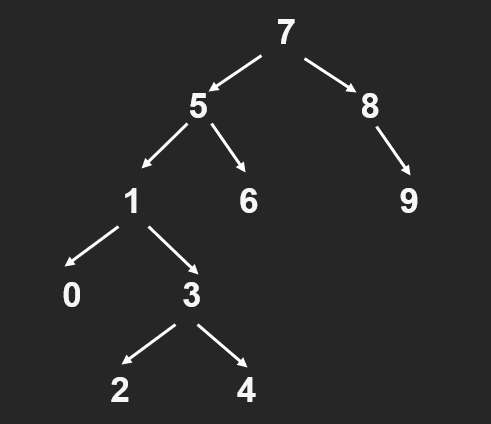

# BINARY SEARCH TREE
---
## 1. [7, 5, 1, 8, 3, 6, 0, 9, 4, 2] dizisinin Binary-Search-Tree aşamalarını yazınız.

**ROOT : 7**

5 7'den küçük olduğu için root'un solunda bulunur.

1 5'ten küçük olduğu için 5'in solunda ve root'un solunda bulunur.

8 7'den büyük olduğu için root'un sağında bulunur.

3 1'den büyük olduğu için 1'in sağında ve root'un solunda bulunur.

6 5'ten büyük olduğu için 5'in sağında ve root'un solunda bulunur.

0 1'den küçük olduğu için 1'in solunda ve root'un solunda bulunur.

9 8'den büyük olduğu için 8'in sağında ve root'un sağında bulunur.

4 3'ten büyük olduğu için 3'ün sağında ve root'un solunda bulunur.

2 3'ten küçük olduğu için 3'ün solunda ve root'un solunda bulunur.

